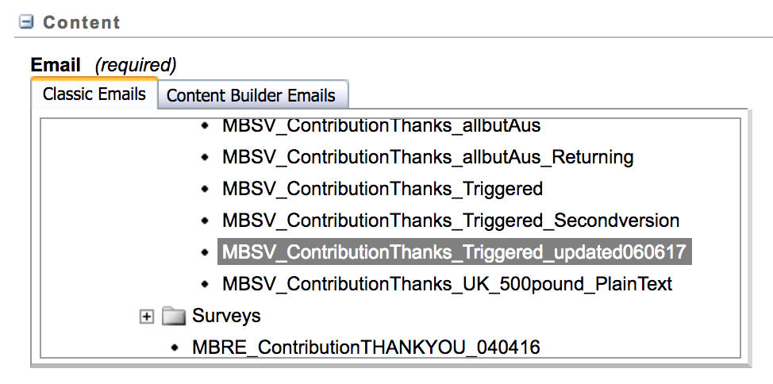
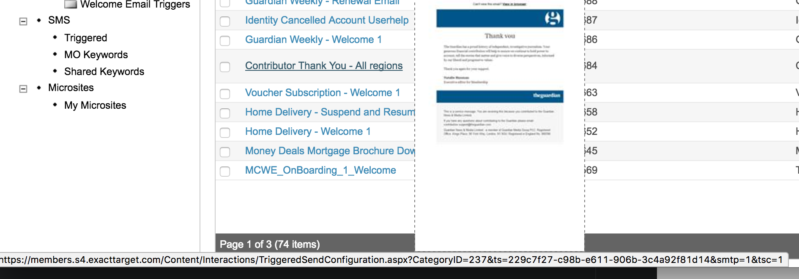

# Sending emails using Exact target and membership workflow
A number of projects such as contributions and support-workers use exact target to send emails. This document describes end to end how the systems work.

There are a number of elements involved:
* [Exact target](https://mc.s4.exacttarget.com/cloud/#app/Email) - Hosted service to create and send templated emails
* [Membership workflow](https://github.com/guardian/membership-workflow) - A scala app which continuously polls an SQS queue picking up any messages it finds there and triggering Exact target email from the data in them.
* Client applications - eg. support-workers. When client applications wish to send an email they post a message to the SQS queue mentioned above with a DataExtensionName attribute which determines which email to send.

Details of how to set up a new email are below.

## Exact target
Docs for triggered send are [here](
https://help.marketingcloud.com/en/documentation/exacttarget/interactions/triggered_emails/triggered_emails_guide/)

* [Sign in to Exact target](https://mc.s4.exacttarget.com/cloud/#app/Email/C12/Default.aspx?entityType=none&entityID=0%23Content)
* Change the 'context' to ‘Consumer’ from the drop down in the top right (it will probably say Guardian Admin when you log in)

There are two things that need to be set up:
#### Email Content
Select Content from the top menu to see these. Contributions emails can be found by expanding

_Shared items > Shared Emails > Membership > Contributor thank you > Final Thank You Versions_

in the left hand pane.

Create a new email here, the easiest way seems to be to use an existing template. If you have an email you want to duplicate you can save it as a template and then create a new email from that template.
#### Triggered send data extension
To see these from the top menu choose _Interactions > Triggered Emails_, then in the left hand pane expand

_Messages > Email > Triggered Sends_

You should then see all the triggered sends in the right hand pane, eg. 'Contributor Thank You - All regions'.
Create a new Triggered send by clicking on the _Create_ button and selecting _Create triggered send_.

Set up the triggered send by giving it a name, setting the 'Send classification' to 'Default transactional' and then picking the email you have just created in the  Content pane (see screenshot)

Once this is done, you need to click on 'Publish Changes' and then at the folder level (at the list of triggered sends) select your new triggered send and click 'Start/Restart'.

Finally, in order to trigger an email using membership workflow you will need to know the external id of the triggered send that you have just created.

To find this out you need to go back to the list of triggered sends and hover the mouse cursor over the link to the one your triggered send. The url that shows up in the bottom of the browser will contain the id as a querystring parameter 'ts'.

In the image below you can see that the 'Contributor Thank You - All regions' triggered send has the id 229c7f27-c98b-e611-906b-3c4a92f81d14

## Membership workflow
To configure membership-workflow to work with your new email you need to:
* Add a new key to the private configuration (membership-workflow.private.conf) at the location `exact-target.triggered-send-keys.my-key`. This should have the id value that you copied from Exact target, make sure that you also add a dummy value for this key into application.conf to keep the CI box happy.
* Add a new DataExtension case object in membership-common ([DataExtension.scala](https://github.com/guardian/membership-common/blob/90e4ccd0c91215ea12997480feceff0da759d96c/src/main/scala/com/gu/exacttarget/DataExtension.scala)). The name of this DataExtension will be used by the client app to specify which email it wants to send and the `getTSKey` parameter should point to the config key you just added.

## Client app
To trigger an email send from your client application you need to put a message onto one of the SQS queues in the membership account which are polled by membership-workflow.

It doesn't actually matter which queue you use (support-workers uses contribution-thanks for everything) just remember to give your app permission to access this queue if you are using CloudFormation (`GetQueueUrl` &
`SendMessage`).

The message should have a body similar to the following:

        {
          "To": {
            "Address": "$email",
            "ContactAttributes": {
              "EmailAddress": "$email",
              "created": "$created",
              "amount": $amount,
              "currency": "$currency",
              "edition": "$edition",
              "name": "$name"
            }
          },
          "DataExtensionName": "$dataExtensionName"
        }
This example is from the 'Contributor Thank You' email, I think the only mandatory fields are `To->Address` and `DataExtensionName`, these should be set to the address of the email recipient and the name of the DataExtension which you added to membership-workflow.
An example of sending these messages can be found in [EmailService](/src/main/scala/com/gu/emailservices/EmailService.scala).
